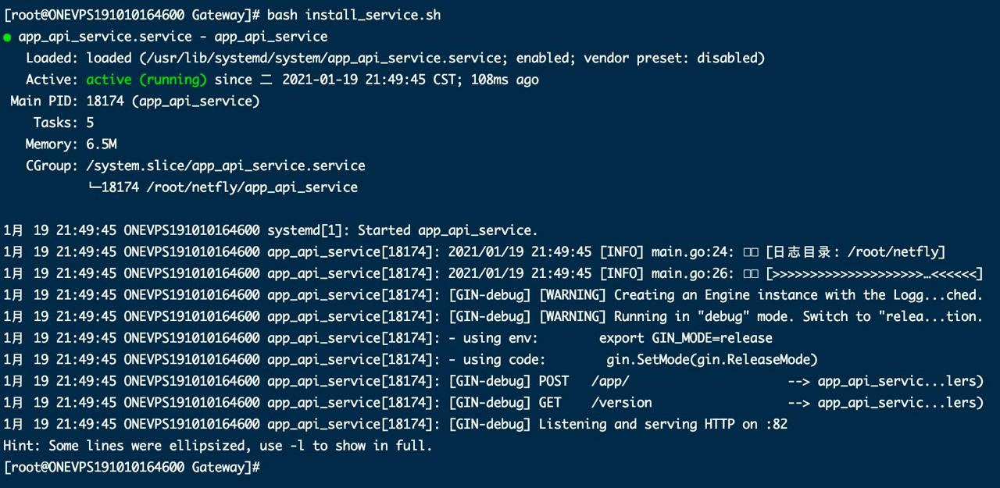

# Malio对接流程


测试站的[地址](h't't'p://test.netflyapp.xyz)


## 对接Gateway


### 1. 对接商城接口

目前支付支持Two-pay, 详细改动参照[链接](https://github.com/NetFly-VPN/Malio-Theme-for-SSPANEL/commit/47c60f46b2798a9f456a31ae3e51de9d7cc28004)

Github[地址](https://github.com/NetFly-VPN/Malio-Theme-for-SSPANEL.git)

commit Hash:**47c60f46b2798a9f456a31ae3e51de9d7cc28004**


### 2. 注册接口


因为原版注册接口加入了人机校验, 以至于直接调用注册接口会失败. 所以另外扩展注册接口, 方法就是讲原来注册接口中关于人机校验部分的逻辑去掉.

在routes.php中增加:

```
// Auth
$app->group('/auth', function () {
   	...
    $this->post('/register_app', App\Controllers\AuthController::class . ':registerAppHandle');
    ...
})->add(new Guest());
```


增加方法registerAppHandle, 实现逻辑复制AuthController.registerHandle方法, 删除下面相关判断:

```
if (Config::get('enable_reg_captcha') === true) {
		...
}
```


### 3. 网关Gateway 程序


#### 下载

[下载地址](http://dw.netflyapp.xyz/gateway.zip)

程序下载完成后, 解压出来, 运行里面的install_service.sh, 不出意外程序就运行起来了.

如果运行成功, 应该能看到如下的文字:




如果不是第一次安装, 而是更新程序的话, 那么原先的配置会备份为netfly_backup, 里面包含原先的配置文件.

**更新程序后, 将netfly_backup中的config.yaml的配置同步到netfly/config.yaml中**.


如果只是更新Gateway程序, 只需运行 **update_service.sh**


#### 配置

配置文件位置:**/root/netfly/config.yaml**

关于Gateway的配置, 里面主要包含几部分:

1. malio面板的地址. 
2. 当前网站支持的支付方式.
3. 商城分类, 以及每类的特权配置

详细参照 config.yaml,其中有详细的说明, 注意yaml文件的格式

*更新config.ymal后, 记得重启服务*, 重启命令:systemctl restart app_api_service.service


#### Gateway 相关命令

```
# 重启服务的命令:
systemctl restart app_api_service.service

# 查看 Gateway运行状态的命令

systemctl status app_api_service.service

# 查看Gateway日志的命令:
journalctl -u app_api_service.service -f
```


## App部分

功能:

1. 协议部分. 目前四个客户端(ios, android, Mac, win) 都支持ssr 协议. 但是ios 尚不支持v2ray.
2. 目前专门针对Malio主题适配了特定版本, 支持支持日常VPN功能, 另外还内置了注册, 登录, 商城, 支付(购买支付一体化)
3. 后续即将上线: app内置公告, 套餐到期体现(app端), 分享. 机场主自定义路由规则等核心功能


软件截图:


# 疑难杂症


## 1. App访问Gateway所有接口都失败,返回相同错误

类似错误:

```
 invalid character '<' looking for beginning of value
```

或者

```
invalid character 'p' after top-level value
```


这种基本上是因为malio接口返回的数据不是json导致的 , 这个时候查看服务器日志: malio接口实际返回内容基本上都是:

```
404 Not Found
```

说明 **网站限制了域名访问**, 这个时候一定要在宝塔上配置网站支持的域名


## 2. 测试站注册新账户是, 请求验证码失败, 返回错误码:19002

同时 错误消息是空的, 原因是: 测试站没有配置用于发送验证码的邮箱


### 3. 如果malio网站做了CDN加速

如果做了加速, 那么Gateway使用的域名也加速的话, 可能就不能自定义端口了. 这个时候最好的方法是用ngnix 做一下反向代理, 把服务器上Gateway的请求, 转发到82端口上.

Gateway的请求路径:

```
/app/
/version
```


配置反向代理的方法, 有两种. 一种直接配置Nginx的配置文件, 第二种在宝塔的malio网站的网站配置文件中添加. 两个都添加如下代码:

```
location /version {
        proxy_pass http://127.0.0.1:82;
    }
    
    location /app/ {
        proxy_pass http://127.0.0.1:82;
    }
```

Nginx配置的详细方法自己Google, 这里只说一下宝塔的配置方法:
在宝塔网站下面找到网站设置, 然后找到配置文件, 如下图:


在所有location的最前面添加上面的代码, 如下图所示:


